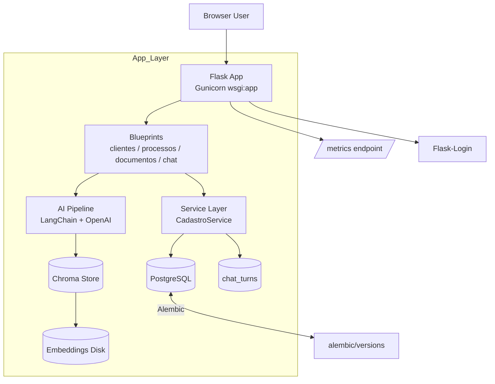
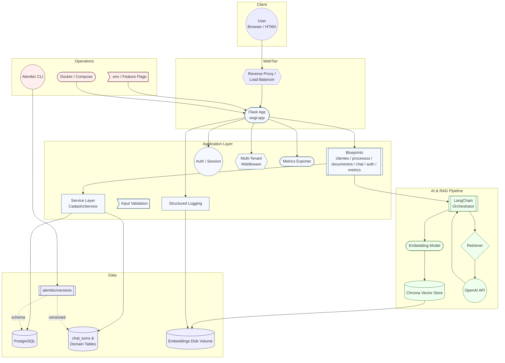
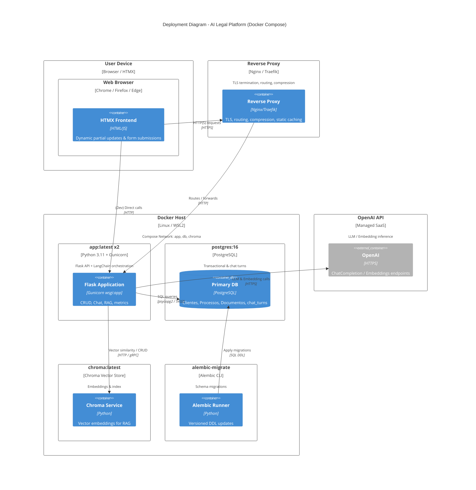
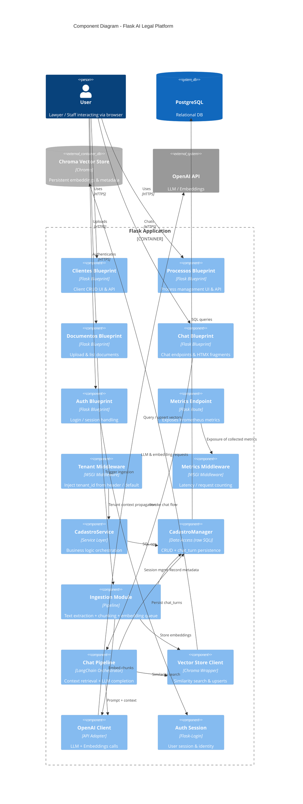
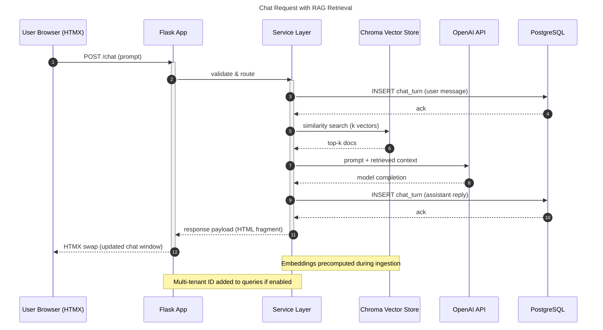
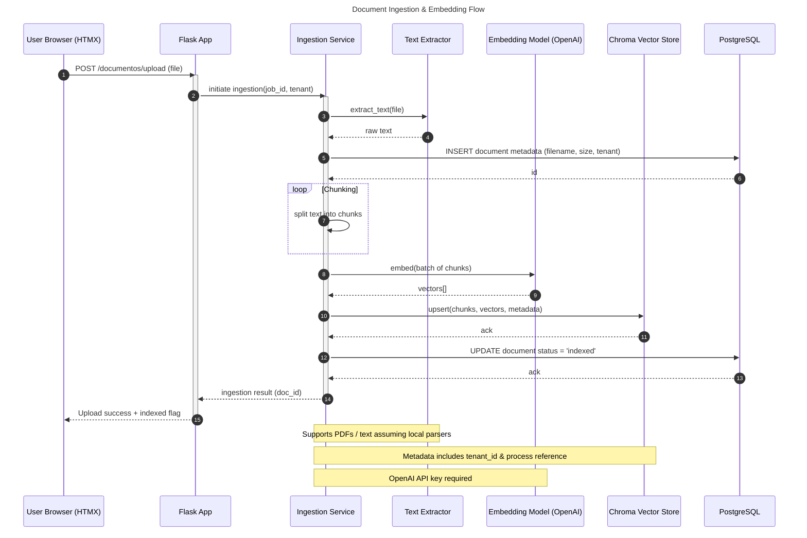

# Advocacia IA Platform

Modern Flask-based multi-tenant law practice assistant with AI chat, document ingestion, and process management.

## Features
- Flask app factory + blueprints (`clientes`, `processos`, `documentos`, `chat`, `auth`, `health`, `metrics`).
- Multi-tenant ready (optional `tenant_id` filtering).
- PostgreSQL via raw SQL + Alembic migrations.
- AI integration (LangChain + OpenAI + Chroma vector store).
- Chat history persisted (`chat_turns`).
- HTMX-enhanced UI fragments for fast interactions.
- Docker multi-stage image + `docker-compose` (app + Postgres).
- Makefile for common tasks.
- Separate `requirements.txt` (runtime) and `requirements-dev.txt`.

## Quick Start (Local)
```powershell
# 1. Create virtual env
python -m venv .venv
.\.venv\Scripts\Activate.ps1

# 2. Install deps
pip install -r requirements.txt -r requirements-dev.txt

# 3. Copy env template
Copy-Item .env.example .env
# Edit .env with real secrets (OPENAI_API_KEY, FLASK_SECRET_KEY)

# 4. Initialize DB (Postgres running)
$env:FLASK_APP="manage.py"; flask db upgrade

# 5. Run dev server
$env:FLASK_APP="manage.py"; flask run -p 5001
```
Visit: http://localhost:5001/

### One-Step Dev Startup
Use the helper script (creates venv, installs deps, applies migrations, runs server):
```powershell
scripts\dev_up.ps1
```
Add `-ForceRecreate` to rebuild the virtual environment.

### Teardown / Cleanup
Stop and clean resources:
```powershell
# Stop Docker stack + remove volumes + remove venv + purge data
scripts\teardown.ps1 -Docker -RemoveVenv -PurgeData

# Only remove venv
scripts\teardown.ps1 -RemoveVenv

# Only stop Docker containers (keep volumes)
scripts\teardown.ps1 -Docker
```

## With Docker Compose
```powershell
docker compose up -d --build
```
Logs:
```powershell
docker compose logs -f app
```

## Makefile Targets
```text
make install          # runtime deps
make install-dev      # + dev deps
make run              # flask dev server
make dev              # gunicorn
make upgrade          # migrations
make revision msg=desc
make docker-build TAG=dev
make docker-run TAG=dev
```

## Environment Variables
See `.env.example` for full list. Key ones:
- FLASK_SECRET_KEY: session security.
- DB_*: PostgreSQL connection.
- MULTI_TENANT=1 to enable tenant scoping.
- OPENAI_API_KEY for AI features.
- CHROMA_PERSIST_DIR path for vector store persistence.

## Database / Migrations
Alembic revisions live in `alembic/versions/`.
To create a new revision:
```powershell
$env:FLASK_APP="manage.py"; flask db revision --autogenerate -m "desc"
$env:FLASK_APP="manage.py"; flask db upgrade
```

## Architecture Overview
```
app/
  __init__.py          # create_app factory
  blueprints/          # route groupings
  middleware.py        # tenant + metrics hooks
  metrics.py           # /metrics endpoint
  services/            # business service layer
cadastro_manager.py     # data access (raw SQL)
manage.py               # Alembic integration
wsgi.py                 # production entry
```

### System Architecture (Core)


### Expanded Architecture (Beta)


### Deployment Diagram


### Component Diagram


### Chat Request Sequence (RAG Flow)


### Document Ingestion Sequence


## AI Pipeline (High-Level)
1. Documents uploaded -> processed & embedded.
2. Stored in Chroma vector store under case context.
3. Chat queries retrieve context via similarity search.
4. LangChain model (OpenAI) generates responses.
5. Exchanges persisted to `chat_turns`.

## Multi-Tenancy
Enable by setting `MULTI_TENANT=1`. All CRUD queries add `tenant_id` filters; default tenant from `DEFAULT_TENANT_ID` or request header (middleware). Plan further isolation with schema-level or row‑level security if needed.

## Development Notes
- Runtime table creation removed: rely solely on Alembic migrations.
- Keep dependency list lean; reintroduce optional libs only if used.
- Use `requirements-dev.txt` for tooling (mypy, pytest).

## Testing
```powershell
pytest -q
```
Add tests under a `tests/` directory (not yet created).

## Production Recommendations
- Use a stronger WAF/Reverse proxy (nginx/traefik) in front of Gunicorn.
- Set `FLASK_ENV=production` and a strong `FLASK_SECRET_KEY`.
- Rotate API keys and secrets via secret manager.
- Enable structured logging and metrics scraping (/metrics).

## LICENSE
Proprietary (adjust as needed).

---
Feel free to request more detailed module docs or a system diagram.
