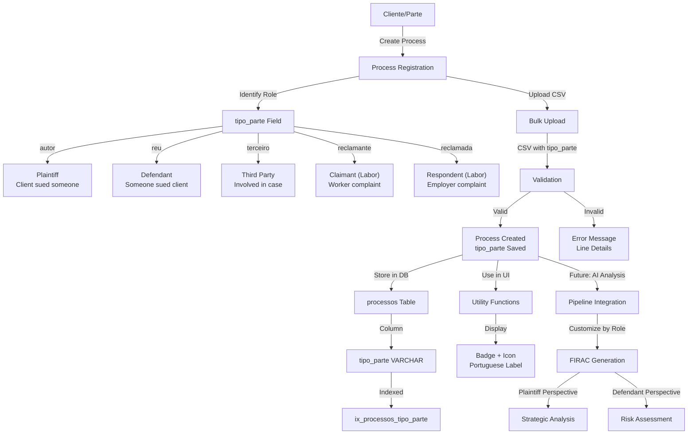
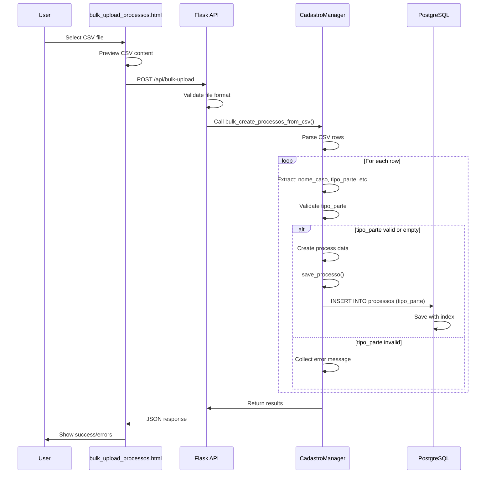
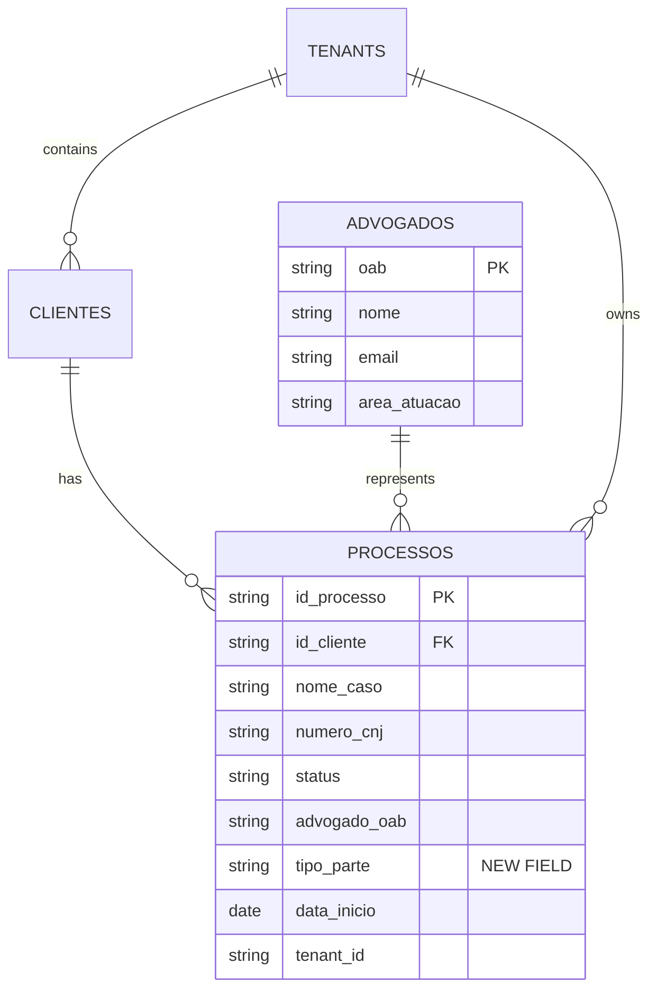
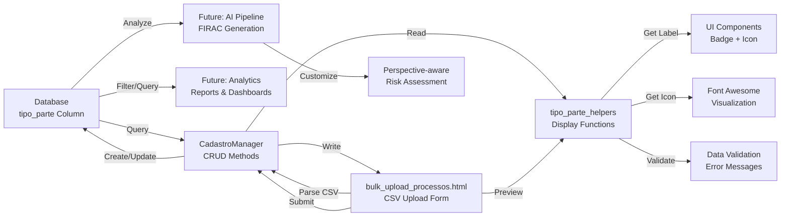
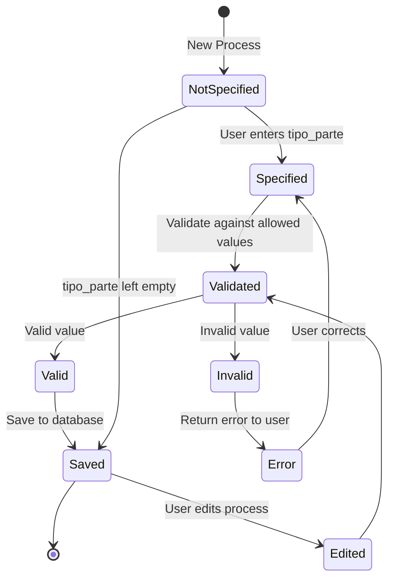
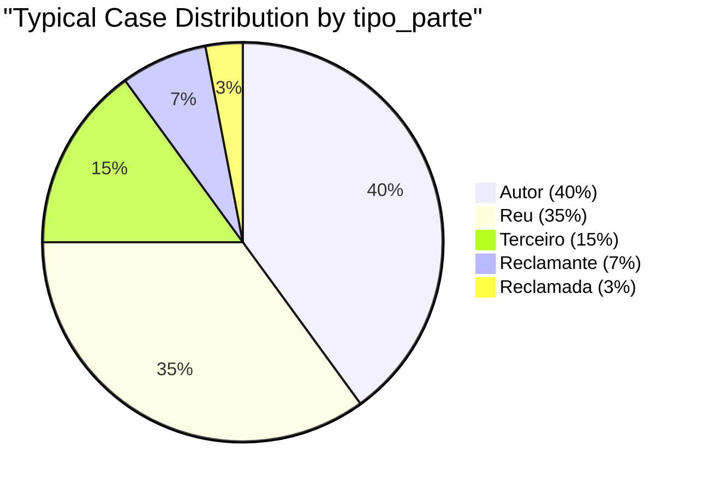
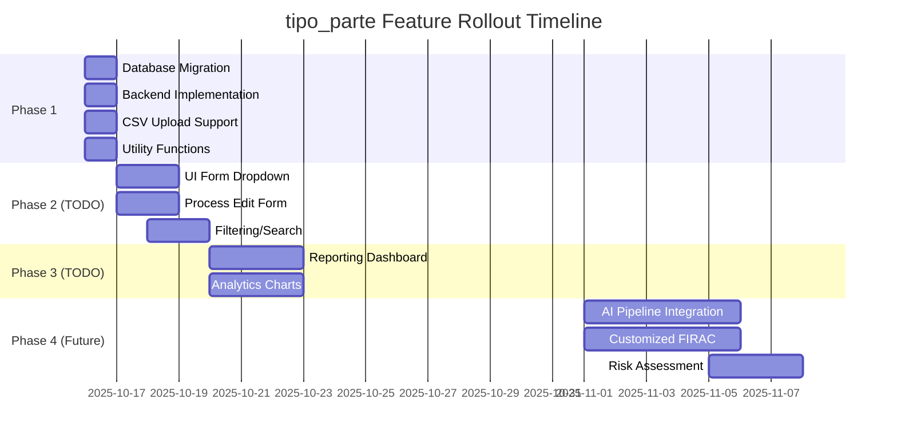

## Data Flow: CSV Upload with tipo_parte

## Entity Relationship: tipo_parte

## Component Interaction: tipo_parte Usage

## State Diagram: tipo_parte Lifecycle

## Value Distribution: Expected uso_parte Patterns

## Feature Roadmap: tipo_parte Integration

